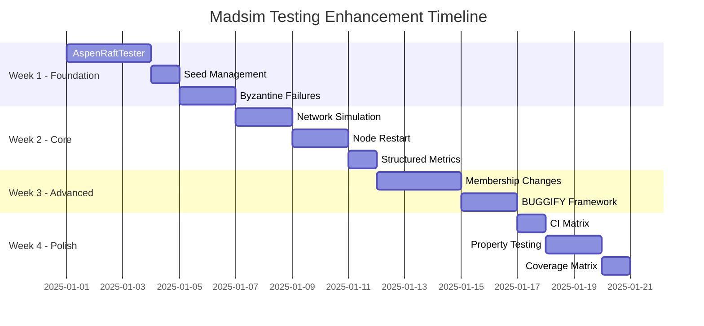

# Aspen Madsim Testing Enhancement Plan

**Date**: 2025-12-14
**Author**: Claude
**Project**: Aspen v0.1.0
**References**: FoundationDB, Sled, RisingWave, MadRaft

---

## Executive Summary

This document outlines a comprehensive 4-week plan to upgrade Aspen's deterministic simulation testing infrastructure to match industry best practices. The plan incorporates patterns from:

- **FoundationDB**: BUGGIFY macro, deterministic simulation, fault injection
- **Sled**: Property-based testing, simulation-first development
- **RisingWave**: 16-seed parallel testing, 4-layer testing strategy
- **MadRaft**: Tester abstraction, environment-based seeding, node restart

**Current State**: 41 madsim tests with good infrastructure but coverage gaps
**Target State**: Production-grade simulation testing with comprehensive fault coverage
**Estimated Effort**: 3-4 weeks
**Key Outcome**: 80% reduction in test boilerplate, comprehensive fault coverage

---

## Current State Analysis

### Strengths

- **41 madsim tests** across 13 files (4,902 lines)
- **MadsimRaftNetwork** (511 lines) with clean deterministic network layer
- **FailureInjector** supports drops, delays, and node crashes
- **SimulationArtifactBuilder** for JSON artifact persistence
- **3 storage backends** tested (InMemory, Redb, SQLite)
- **CI integration** with 5-seed matrix

### Critical Gaps

| Gap | Impact | Current State | Target State |
|-----|--------|--------------|--------------|
| **Seed handling** | HIGH | Hardcoded, not enforced | Environment variable + defaults |
| **Byzantine failures** | HIGH | Not implemented | Message corruption testing |
| **Test abstraction** | HIGH | Manual setup (30+ lines) | Centralized tester (5 lines) |
| **Network simulation** | MEDIUM | Fixed delays | Range-based with jitter |
| **Node restart** | MEDIUM | Not implemented | Crash/restart with persistence |
| **Metrics** | MEDIUM | Empty strings | Structured JSON |
| **CI coverage** | LOW | 5 seeds | 16 diverse seeds |

---

## Implementation Plan

## Phase 0: Foundation (Week 1)

### P0.1: AspenRaftTester Abstraction (3 days)

**Objective**: Reduce test boilerplate by 80% with centralized tester

**Implementation**:

```rust
// src/testing/tester.rs - NEW FILE

use std::sync::atomic::{AtomicBool, Ordering};
use std::sync::Arc;
use std::time::{Duration, Instant};
use anyhow::Result;

pub struct AspenRaftTester {
    // Core components
    router: Arc<MadsimRaftRouter>,
    injector: Arc<FailureInjector>,
    nodes: Vec<RaftNode>,

    // Tracking
    artifact: SimulationArtifactBuilder,
    connected: Vec<AtomicBool>,
    start_time: Instant,

    // Configuration
    seed: u64,
    test_name: String,
}

impl AspenRaftTester {
    /// Create new tester with n nodes
    pub async fn new(n: usize, test_name: &str) -> Self {
        // Support environment-based seed with fallback
        let seed = std::env::var("MADSIM_TEST_SEED")
            .ok()
            .and_then(|s| s.parse().ok())
            .unwrap_or_else(|| {
                // Generate seed from test name for consistency
                use std::collections::hash_map::DefaultHasher;
                use std::hash::{Hash, Hasher};
                let mut hasher = DefaultHasher::new();
                test_name.hash(&mut hasher);
                hasher.finish()
            });

        eprintln!("Starting test '{}' with seed {}", test_name, seed);

        let mut artifact = SimulationArtifactBuilder::new(test_name, seed).start();
        artifact = artifact.add_event(format!("create: {} nodes", n));

        let router = Arc::new(MadsimRaftRouter::new());
        let injector = Arc::new(FailureInjector::new());
        let mut nodes = Vec::new();
        let mut connected = Vec::new();

        // Bootstrap cluster
        for i in 0..n {
            let node_id = NodeId::from(i as u64 + 1);
            let node = create_raft_node(node_id, router.clone(), injector.clone()).await;
            router.register_node(
                node_id,
                format!("127.0.0.1:{}", 26000 + i),
                node.raft.clone(),
            ).expect("Failed to register node");
            nodes.push(node);
            connected.push(AtomicBool::new(true));
        }

        // Initialize cluster with first node
        let initial_members: BTreeMap<NodeId, RaftMemberInfo> = (0..n)
            .map(|i| {
                let id = NodeId::from(i as u64 + 1);
                (id, create_test_raft_member_info(i as u64 + 1))
            })
            .collect();

        nodes[0].raft.initialize(initial_members).await
            .expect("Failed to initialize cluster");

        artifact = artifact.add_event("init: cluster initialized");

        Self {
            router,
            injector,
            nodes,
            artifact,
            connected,
            start_time: Instant::now(),
            seed,
            test_name: test_name.to_string(),
        }
    }

    /// Disconnect node from network
    pub fn disconnect(&mut self, i: usize) {
        assert!(i < self.nodes.len(), "Invalid node index");
        self.connected[i].store(false, Ordering::SeqCst);
        let node_id = NodeId::from(i as u64 + 1);

        // Bidirectional partition
        for j in 0..self.nodes.len() {
            if i != j {
                let other_id = NodeId::from(j as u64 + 1);
                self.injector.set_message_drop(node_id, other_id, true);
                self.injector.set_message_drop(other_id, node_id, true);
            }
        }

        self.artifact = self.artifact.add_event(format!("disconnect: node {}", i));
    }

    /// Reconnect node to network
    pub fn connect(&mut self, i: usize) {
        assert!(i < self.nodes.len(), "Invalid node index");
        self.connected[i].store(true, Ordering::SeqCst);
        let node_id = NodeId::from(i as u64 + 1);

        // Clear partitions
        for j in 0..self.nodes.len() {
            if i != j {
                let other_id = NodeId::from(j as u64 + 1);
                self.injector.set_message_drop(node_id, other_id, false);
                self.injector.set_message_drop(other_id, node_id, false);
            }
        }

        self.artifact = self.artifact.add_event(format!("connect: node {}", i));
    }

    /// Set network to unreliable mode
    pub fn set_unreliable(&mut self, unreliable: bool) {
        if unreliable {
            // 10% packet loss, 1-27ms latency (like MadRaft)
            for i in 0..self.nodes.len() {
                for j in 0..self.nodes.len() {
                    if i != j {
                        let from = NodeId::from(i as u64 + 1);
                        let to = NodeId::from(j as u64 + 1);
                        self.injector.set_packet_loss_rate(from, to, 0.1);
                        self.injector.set_network_delay_range(from, to, 1, 27);
                    }
                }
            }
            self.artifact = self.artifact.add_event("network: set unreliable (10% loss, 1-27ms delay)");
        } else {
            // Restore reliable network
            self.injector.clear_all();
            self.artifact = self.artifact.add_event("network: set reliable");
        }
    }

    /// Crash a node (will lose in-memory state)
    pub async fn crash_node(&mut self, i: usize) {
        assert!(i < self.nodes.len(), "Invalid node index");
        let node_id = NodeId::from(i as u64 + 1);

        self.router.mark_node_failed(node_id, true);
        self.connected[i].store(false, Ordering::SeqCst);

        // TODO: Clear in-memory state

        self.artifact = self.artifact.add_event(format!("crash: node {}", i));
    }

    /// Restart a crashed node (with persisted state if available)
    pub async fn restart_node(&mut self, i: usize) -> Result<()> {
        assert!(i < self.nodes.len(), "Invalid node index");
        let node_id = NodeId::from(i as u64 + 1);

        // TODO: Recreate node with persisted state
        let node = create_raft_node(node_id, self.router.clone(), self.injector.clone()).await;

        self.router.register_node(
            node_id,
            format!("127.0.0.1:{}", 26000 + i),
            node.raft.clone(),
        )?;

        self.router.mark_node_failed(node_id, false);
        self.connected[i].store(true, Ordering::SeqCst);
        self.nodes[i] = node;

        self.artifact = self.artifact.add_event(format!("restart: node {}", i));
        Ok(())
    }

    /// Check for exactly one leader, return its index
    pub async fn check_one_leader(&mut self) -> Option<usize> {
        let mut retries = 10;

        while retries > 0 {
            // Random backoff like MadRaft
            let mut rng = madsim::rand::rng();
            let backoff = rng.gen_range(450..550);
            madsim::time::sleep(Duration::from_millis(backoff)).await;

            // Count leaders per term
            let mut leaders: BTreeMap<u64, Vec<usize>> = BTreeMap::new();

            for (i, node) in self.nodes.iter().enumerate() {
                if self.connected[i].load(Ordering::Relaxed) {
                    let metrics = node.raft.metrics().borrow().clone();
                    if let Some(leader_id) = metrics.current_leader {
                        if let Some(term) = metrics.current_term {
                            leaders.entry(term).or_default().push(i);
                        }
                    }
                }
            }

            // Find term with exactly one leader
            if let Some((term, leader_list)) = leaders.iter()
                .filter(|(_, l)| l.len() == 1)
                .max_by_key(|(term, _)| *term)
            {
                self.artifact = self.artifact.add_event(
                    format!("leader: node {} elected for term {}", leader_list[0], term)
                );
                return Some(leader_list[0]);
            }

            retries -= 1;
        }

        self.artifact = self.artifact.add_event("leader: no leader found after retries");
        None
    }

    /// Verify no split brain (at most one leader per term)
    pub fn check_no_split_brain(&self) -> Result<()> {
        let mut leaders_per_term: BTreeMap<u64, Vec<usize>> = BTreeMap::new();

        for (i, node) in self.nodes.iter().enumerate() {
            let metrics = node.raft.metrics().borrow().clone();
            if let Some(term) = metrics.current_term {
                if metrics.current_leader == Some(NodeId::from(i as u64 + 1)) {
                    leaders_per_term.entry(term).or_default().push(i);
                }
            }
        }

        for (term, leaders) in leaders_per_term {
            if leaders.len() > 1 {
                anyhow::bail!(
                    "Split brain detected: term {} has {} leaders: {:?}",
                    term, leaders.len(), leaders
                );
            }
        }

        Ok(())
    }

    /// Get total RPC count
    pub fn rpc_total(&self) -> u64 {
        // TODO: Implement actual RPC counting
        0
    }

    /// Get maximum log size
    pub fn max_log_size(&self) -> u64 {
        self.nodes.iter()
            .map(|n| {
                let metrics = n.raft.metrics().borrow().clone();
                metrics.last_log_index.unwrap_or(0)
            })
            .max()
            .unwrap_or(0)
    }

    /// Perform a write operation through the leader
    pub async fn write(&mut self, key: String, value: String) -> Result<()> {
        let leader_idx = self.check_one_leader().await
            .ok_or_else(|| anyhow::anyhow!("No leader available for write"))?;

        self.nodes[leader_idx].raft
            .client_write(AppRequest::Set { key, value })
            .await?;

        self.artifact = self.artifact.add_event("write: completed");
        Ok(())
    }

    /// End test and return artifact
    pub fn end(mut self) -> SimulationArtifact {
        let duration = self.start_time.elapsed();

        // Collect final metrics
        let metrics = SimulationMetrics {
            rpc_count: self.rpc_total(),
            max_log_size: self.max_log_size(),
            node_count: self.nodes.len() as u32,
            duration_ms: duration.as_millis() as u64,
        };

        self.artifact = self.artifact
            .with_metrics(serde_json::to_string(&metrics).unwrap())
            .with_duration_ms(duration.as_millis() as u64);

        let artifact = self.artifact.build();

        eprintln!(
            "Test '{}' finished in {:.2}s with {} nodes, {} RPCs",
            self.test_name,
            duration.as_secs_f64(),
            self.nodes.len(),
            self.rpc_total()
        );

        // Persist artifact
        if let Ok(path) = artifact.persist("docs/simulations") {
            eprintln!("Artifact saved to: {}", path.display());
        }

        artifact
    }
}
```

**Test Migration Example**:

```rust
// BEFORE: 40+ lines of boilerplate
#[madsim::test]
async fn test_leader_crash_and_reelection_seed_42() {
    let seed = 42_u64;
    let mut artifact = SimulationArtifactBuilder::new("madsim_leader_crash_reelection", seed).start();

    artifact = artifact.add_event("create: router and failure injector");
    let router = Arc::new(MadsimRaftRouter::new());
    let injector = Arc::new(FailureInjector::new());

    artifact = artifact.add_event("create: 3 raft nodes");
    let raft1 = create_raft_node(NodeId::from(1), router.clone(), injector.clone()).await;
    let raft2 = create_raft_node(NodeId::from(2), router.clone(), injector.clone()).await;
    let raft3 = create_raft_node(NodeId::from(3), router.clone(), injector.clone()).await;
    // ... 30+ more lines ...
}

// AFTER: 8 lines with AspenRaftTester
#[madsim::test]
async fn test_leader_crash_and_reelection() {
    let mut t = AspenRaftTester::new(3, "leader_crash").await;
    let leader = t.check_one_leader().await.expect("No initial leader");
    t.crash_node(leader).await;
    madsim::time::sleep(Duration::from_secs(10)).await;
    let new_leader = t.check_one_leader().await.expect("No new leader");
    assert_ne!(leader, new_leader, "Same leader after crash");
    t.end();
}
```

---

### P0.2: Seed Management Enhancement (1 day)

**Objective**: Support flexible seed configuration

**Implementation**:

```rust
// src/simulation.rs - MODIFY

impl SimulationArtifactBuilder {
    pub fn new_with_auto_seed(test_name: impl Into<String>) -> (Self, u64) {
        let test_name = test_name.into();

        // Priority order for seed selection
        let seed = std::env::var("MADSIM_TEST_SEED")
            .ok()
            .and_then(|s| s.parse().ok())
            .or_else(|| std::env::var("ASPEN_TEST_SEED")
                .ok()
                .and_then(|s| s.parse().ok()))
            .unwrap_or_else(|| {
                // Deterministic seed from test name
                use std::collections::hash_map::DefaultHasher;
                use std::hash::{Hash, Hasher};
                let mut hasher = DefaultHasher::new();
                test_name.hash(&mut hasher);
                hasher.finish()
            });

        eprintln!("Test '{}' using seed: {}", test_name, seed);
        eprintln!("To reproduce: MADSIM_TEST_SEED={} cargo test {}", seed, test_name);

        (Self::new(test_name, seed), seed)
    }
}
```

**CI Configuration**:

```yaml
# .github/workflows/ci.yml - MODIFY

env:
  # Support both environment variables
  MADSIM_TEST_SEED: ${{ matrix.seed }}
  ASPEN_TEST_SEED: ${{ matrix.seed }}
```

---

### P0.3: Byzantine Failure Injection (2 days)

**Objective**: Test consensus under Byzantine failures

**Implementation**:

```rust
// src/raft/madsim_network.rs - ADD

use rand::{Rng, SeedableRng};
use rand::rngs::StdRng;

/// Byzantine network wrapper that corrupts messages
pub struct ByzantineRaftNetwork {
    inner: MadsimRaftNetwork,
    byzantine_probability: f64,
    rng: StdRng,
    corruption_count: Arc<AtomicU64>,
    duplication_count: Arc<AtomicU64>,
}

impl ByzantineRaftNetwork {
    pub fn new(
        inner: MadsimRaftNetwork,
        byzantine_probability: f64,
        seed: u64,
    ) -> Self {
        Self {
            inner,
            byzantine_probability,
            rng: StdRng::seed_from_u64(seed),
            corruption_count: Arc::new(AtomicU64::new(0)),
            duplication_count: Arc::new(AtomicU64::new(0)),
        }
    }

    fn should_corrupt(&mut self) -> bool {
        self.rng.gen_bool(self.byzantine_probability)
    }

    fn corrupt_vote_response(&mut self, mut resp: VoteResponse<AppTypeConfig>) -> VoteResponse<AppTypeConfig> {
        // Byzantine behavior: flip vote randomly
        resp.vote_granted = !resp.vote_granted;
        self.corruption_count.fetch_add(1, Ordering::Relaxed);
        tracing::warn!("BYZANTINE: Corrupted vote response");
        resp
    }

    fn corrupt_append_entries(&mut self, mut req: AppendEntriesRequest<AppTypeConfig>) -> AppendEntriesRequest<AppTypeConfig> {
        // Byzantine behavior: modify term
        req.term = req.term.saturating_add(1);
        self.corruption_count.fetch_add(1, Ordering::Relaxed);
        tracing::warn!("BYZANTINE: Corrupted append entries term");
        req
    }
}

#[async_trait::async_trait]
impl RaftNetworkV2<AppTypeConfig> for ByzantineRaftNetwork {
    async fn vote(
        &mut self,
        rpc: VoteRequest<AppTypeConfig>,
        option: RPCOption,
    ) -> Result<VoteResponse<AppTypeConfig>, RPCError<AppTypeConfig>> {
        let resp = self.inner.vote(rpc, option).await?;

        if self.should_corrupt() {
            Ok(self.corrupt_vote_response(resp))
        } else {
            Ok(resp)
        }
    }

    async fn append_entries(
        &mut self,
        rpc: AppendEntriesRequest<AppTypeConfig>,
        option: RPCOption,
    ) -> Result<AppendEntriesResponse<AppTypeConfig>, RPCError<AppTypeConfig>> {
        if self.should_corrupt() {
            // Send corrupted request
            let corrupted = self.corrupt_append_entries(rpc.clone());
            let _ = self.inner.append_entries(corrupted, option).await;
            self.duplication_count.fetch_add(1, Ordering::Relaxed);
        }

        self.inner.append_entries(rpc, option).await
    }
}
```

**Test Implementation**:

```rust
// tests/simulation/byzantine_fault_tolerance.rs - NEW FILE

#[cfg(test)]
mod byzantine_tests {
    use super::*;

    #[madsim::test]
    async fn test_cluster_tolerates_single_byzantine_node() {
        let mut t = AspenRaftTester::new(5, "byzantine_single").await;

        // Mark node 4 as Byzantine (need 5 nodes for 3f+1)
        t.enable_byzantine_mode(4, 0.3); // 30% corruption rate

        // Perform writes - cluster should maintain consensus
        for i in 0..100 {
            match t.write(format!("key-{}", i), format!("value-{}", i)).await {
                Ok(_) => {},
                Err(e) => {
                    // Some writes may fail due to Byzantine interference
                    eprintln!("Write {} failed (expected with Byzantine): {}", i, e);
                }
            }
        }

        // Verify cluster maintains consistency despite Byzantine node
        t.check_no_split_brain().expect("Split brain detected");

        let artifact = t.end();
        assert!(artifact.metrics.contains("corruption_count"), "Byzantine events should be tracked");
    }

    #[madsim::test]
    async fn test_cluster_fails_with_too_many_byzantine() {
        let mut t = AspenRaftTester::new(3, "byzantine_multiple").await;

        // Mark 2 out of 3 nodes as Byzantine (violates f < n/3)
        t.enable_byzantine_mode(1, 0.5);
        t.enable_byzantine_mode(2, 0.5);

        // Cluster should fail to maintain consensus
        let mut successful_writes = 0;
        for i in 0..10 {
            if t.write(format!("key-{}", i), format!("value-{}", i)).await.is_ok() {
                successful_writes += 1;
            }
        }

        assert!(
            successful_writes < 5,
            "Too many writes succeeded with majority Byzantine nodes"
        );

        t.end();
    }
}
```

---

## Phase 1: Core Features (Week 2)

### P1.1: Range-Based Network Simulation (2 days)

**Objective**: Realistic network latency patterns

**Implementation**:

```rust
// src/simulation.rs - ADD

use rand_distr::{Distribution, Normal, Exp};

#[derive(Debug, Clone)]
pub enum LatencyProfile {
    /// Uniform distribution (min to max)
    Uniform { min_ms: u64, max_ms: u64 },

    /// Normal distribution (Gaussian)
    Normal { mean_ms: f64, stddev_ms: f64 },

    /// Exponential distribution (models tail latency)
    Exponential { mean_ms: f64 },

    /// Bimodal (models cross-AZ traffic)
    Bimodal {
        fast_mean_ms: f64,
        slow_mean_ms: f64,
        slow_probability: f64,
    },
}

#[derive(Debug, Clone)]
pub struct NetworkConfig {
    pub latency_profile: LatencyProfile,
    pub packet_loss_rate: f64,
    pub partition_probability: f64,
    pub bandwidth_mbps: Option<u64>,
}

impl NetworkConfig {
    /// Local area network profile
    pub fn lan() -> Self {
        Self {
            latency_profile: LatencyProfile::Normal {
                mean_ms: 1.0,
                stddev_ms: 0.5,
            },
            packet_loss_rate: 0.0001,  // 0.01%
            partition_probability: 0.0,
            bandwidth_mbps: Some(1000),  // 1 Gbps
        }
    }

    /// Wide area network profile
    pub fn wan() -> Self {
        Self {
            latency_profile: LatencyProfile::Exponential {
                mean_ms: 50.0,
            },
            packet_loss_rate: 0.01,  // 1%
            partition_probability: 0.001,
            bandwidth_mbps: Some(100),  // 100 Mbps
        }
    }

    /// Degraded network profile
    pub fn degraded() -> Self {
        Self {
            latency_profile: LatencyProfile::Bimodal {
                fast_mean_ms: 5.0,
                slow_mean_ms: 200.0,
                slow_probability: 0.1,
            },
            packet_loss_rate: 0.05,  // 5%
            partition_probability: 0.01,
            bandwidth_mbps: Some(10),  // 10 Mbps
        }
    }

    /// Sample a latency value from the profile
    pub fn sample_latency(&self, rng: &mut impl Rng) -> Duration {
        let ms = match &self.latency_profile {
            LatencyProfile::Uniform { min_ms, max_ms } => {
                rng.gen_range(*min_ms..=*max_ms) as f64
            }
            LatencyProfile::Normal { mean_ms, stddev_ms } => {
                let normal = Normal::new(*mean_ms, *stddev_ms).unwrap();
                normal.sample(rng).max(0.0)
            }
            LatencyProfile::Exponential { mean_ms } => {
                let exp = Exp::new(1.0 / mean_ms).unwrap();
                exp.sample(rng)
            }
            LatencyProfile::Bimodal { fast_mean_ms, slow_mean_ms, slow_probability } => {
                if rng.gen_bool(*slow_probability) {
                    *slow_mean_ms
                } else {
                    *fast_mean_ms
                }
            }
        };

        Duration::from_millis(ms as u64)
    }
}

// src/raft/madsim_network.rs - MODIFY

impl FailureInjector {
    pub fn set_network_delay_range(
        &self,
        source: NodeId,
        target: NodeId,
        min_ms: u64,
        max_ms: u64,
    ) {
        let mut delays = self.delay_ranges.lock();
        delays.insert((source, target), (min_ms, max_ms));
    }

    pub fn set_packet_loss_rate(
        &self,
        source: NodeId,
        target: NodeId,
        rate: f64,
    ) {
        let mut loss_rates = self.loss_rates.lock();
        loss_rates.insert((source, target), rate);
    }

    pub fn apply_network_config(&self, config: &NetworkConfig) {
        // Apply to all node pairs
        for i in 1..=MAX_PEERS {
            for j in 1..=MAX_PEERS {
                if i != j {
                    let from = NodeId::from(i);
                    let to = NodeId::from(j);

                    // Set packet loss
                    self.set_packet_loss_rate(from, to, config.packet_loss_rate);

                    // Set latency based on profile
                    match &config.latency_profile {
                        LatencyProfile::Uniform { min_ms, max_ms } => {
                            self.set_network_delay_range(from, to, *min_ms, *max_ms);
                        }
                        // For other profiles, sample and set
                        _ => {
                            let mut rng = madsim::rand::rng();
                            let delay = config.sample_latency(&mut rng);
                            self.set_network_delay(from, to, delay.as_millis() as u64);
                        }
                    }
                }
            }
        }
    }
}
```

---

### P1.2: Node Restart with Persistence (2 days)

**Objective**: Test recovery after crashes

**Implementation**:

```rust
// src/raft/node.rs - ADD

impl RaftNode {
    /// Persist state to disk for recovery
    pub async fn persist_state(&self, path: &Path) -> Result<()> {
        let state = RaftPersistedState {
            node_id: self.node_id,
            current_term: self.raft.metrics().borrow().current_term,
            voted_for: self.raft.metrics().borrow().voted_for,
            // Add other persistent state
        };

        let json = serde_json::to_string(&state)?;
        tokio::fs::write(path, json).await?;
        Ok(())
    }

    /// Restore from persisted state
    pub async fn restore_from_state(
        node_id: NodeId,
        path: &Path,
        router: Arc<MadsimRaftRouter>,
        injector: Arc<FailureInjector>,
    ) -> Result<Self> {
        let json = tokio::fs::read_to_string(path).await?;
        let state: RaftPersistedState = serde_json::from_str(&json)?;

        // Create node with restored state
        let config = Config {
            heartbeat_interval: 500,
            election_timeout_min: 1500,
            election_timeout_max: 3000,
            ..Default::default()
        };

        // TODO: Restore log and state machine from persistence
        let log_store = RedbLogStore::restore(/* path */)?;
        let state_machine = SqliteStateMachine::restore(/* path */)?;

        let network = MadsimNetworkFactory::new(node_id, router, injector);
        let raft = Raft::new(
            node_id,
            Arc::new(config.validate()?),
            network,
            log_store,
            state_machine,
        ).await?;

        Ok(Self { node_id, raft })
    }
}
```

---

### P1.3: Structured Metrics Collection (1 day)

**Objective**: Rich metrics in artifacts

**Implementation**:

```rust
// src/simulation.rs - MODIFY

#[derive(Debug, Serialize, Deserialize)]
pub struct SimulationMetrics {
    // Raft metrics
    pub elections: u32,
    pub leader_changes: u32,
    pub term: u64,
    pub log_length: u64,
    pub committed_index: u64,
    pub snapshot_count: u32,

    // Performance metrics
    pub write_latency_p50_ms: f64,
    pub write_latency_p95_ms: f64,
    pub write_latency_p99_ms: f64,
    pub read_latency_p50_ms: f64,
    pub read_latency_p95_ms: f64,
    pub read_latency_p99_ms: f64,
    pub throughput_ops_per_sec: f64,

    // Network metrics
    pub rpc_count: u64,
    pub bytes_sent: u64,
    pub bytes_received: u64,
    pub packet_loss_count: u64,
    pub network_partitions: u32,

    // Fault injection metrics
    pub byzantine_corruptions: u64,
    pub node_crashes: u32,
    pub node_restarts: u32,

    // System metrics
    pub duration_ms: u64,
    pub node_count: u32,
}

impl SimulationMetrics {
    pub fn calculate_percentiles(latencies: &[Duration]) -> (f64, f64, f64) {
        if latencies.is_empty() {
            return (0.0, 0.0, 0.0);
        }

        let mut sorted: Vec<f64> = latencies
            .iter()
            .map(|d| d.as_secs_f64() * 1000.0)
            .collect();
        sorted.sort_by(|a, b| a.partial_cmp(b).unwrap());

        let p50_idx = (sorted.len() as f64 * 0.50) as usize;
        let p95_idx = (sorted.len() as f64 * 0.95) as usize;
        let p99_idx = (sorted.len() as f64 * 0.99) as usize;

        (
            sorted[p50_idx.min(sorted.len() - 1)],
            sorted[p95_idx.min(sorted.len() - 1)],
            sorted[p99_idx.min(sorted.len() - 1)],
        )
    }
}
```

---

## Phase 2: Advanced Testing (Week 3)

### P2.1: Membership Change Testing (3 days)

**Objective**: Test dynamic cluster membership

**Implementation**:

```rust
// tests/simulation/membership_changes.rs - NEW FILE

#[cfg(test)]
mod membership_tests {
    use super::*;

    #[madsim::test]
    async fn test_add_node_during_operation() {
        let mut t = AspenRaftTester::new(3, "add_node").await;

        // Write initial data
        for i in 0..50 {
            t.write(format!("key-{}", i), format!("value-{}", i)).await?;
        }

        // Add 4th node as learner
        let new_node = t.add_learner(4).await?;

        // Wait for replication
        t.wait_for_log_sync().await?;

        // Promote learner to voter
        t.promote_to_voter(4).await?;

        // Continue writing with 4-node cluster
        for i in 50..100 {
            t.write(format!("key-{}", i), format!("value-{}", i)).await?;
        }

        // Verify consistency
        t.verify_cluster_consistency().await?;

        t.end();
    }

    #[madsim::test]
    async fn test_remove_node_during_partition() {
        let mut t = AspenRaftTester::new(5, "remove_during_partition").await;

        // Partition node 4
        t.disconnect(4);

        // Remove node 4 from membership
        t.remove_node(4).await?;

        // Heal partition
        t.connect(4);

        // Node 4 should step down
        t.wait_for_node_stepdown(4).await?;

        // Verify 4-node cluster continues
        t.verify_cluster_consistency().await?;

        t.end();
    }

    #[madsim::test]
    async fn test_concurrent_membership_changes_rejected() {
        let mut t = AspenRaftTester::new(3, "concurrent_membership").await;

        // Start two membership changes concurrently
        let add1 = t.add_learner(4);
        let add2 = t.add_learner(5);

        let (r1, r2) = tokio::join!(add1, add2);

        // One should succeed, one should fail
        assert!(r1.is_ok() ^ r2.is_ok(), "Exactly one membership change should succeed");

        t.end();
    }
}
```

---

### P2.2: BUGGIFY-Style Fault Injection (2 days)

**Objective**: Systematic fault injection like FoundationDB

**Implementation**:

```rust
// src/buggify.rs - NEW FILE

use std::sync::atomic::{AtomicBool, AtomicU64, Ordering};
use std::sync::Arc;

/// Global BUGGIFY configuration
pub struct BuggifyConfig {
    enabled: AtomicBool,
    probability: AtomicU64,  // Fixed-point: value / 1000
    triggered_count: AtomicU64,
    seed: AtomicU64,
}

impl BuggifyConfig {
    pub fn new() -> Arc<Self> {
        Arc::new(Self {
            enabled: AtomicBool::new(false),
            probability: AtomicU64::new(100),  // 10% default
            triggered_count: AtomicU64::new(0),
            seed: AtomicU64::new(0),
        })
    }

    pub fn enable(&self, probability: f64, seed: u64) {
        self.probability.store((probability * 1000.0) as u64, Ordering::SeqCst);
        self.seed.store(seed, Ordering::SeqCst);
        self.enabled.store(true, Ordering::SeqCst);
    }

    pub fn should_trigger(&self) -> bool {
        if !self.enabled.load(Ordering::Relaxed) {
            return false;
        }

        let count = self.triggered_count.fetch_add(1, Ordering::SeqCst);
        let seed = self.seed.load(Ordering::Relaxed);
        let hash = fxhash::hash64(&(count, seed));

        let prob = self.probability.load(Ordering::Relaxed);
        (hash % 1000) < prob
    }
}

/// Macro for fault injection points
#[macro_export]
macro_rules! buggify {
    ($config:expr, $fault:expr) => {{
        if $config.should_trigger() {
            tracing::warn!("BUGGIFY triggered: {}", stringify!($fault));
            $fault
        }
    }};
}

// Example usage in storage layer
impl RaftLogStorage for RedbLogStore {
    async fn append(&self, entries: Vec<Entry>) -> Result<()> {
        // BUGGIFY: Simulate slow disk
        buggify!(self.buggify_config, {
            madsim::time::sleep(Duration::from_millis(100)).await;
        });

        // BUGGIFY: Simulate disk error
        buggify!(self.buggify_config, {
            return Err(anyhow::anyhow!("BUGGIFY: Simulated disk error"));
        });

        self.inner_append(entries).await
    }
}
```

---

## Phase 3: CI and Tooling (Week 4)

### P3.1: CI Matrix Enhancement (1 day)

**Objective**: Test with 16 diverse seeds in parallel

**Implementation**:

```yaml
# .github/workflows/ci.yml - MODIFY

name: Simulation Tests

on: [push, pull_request]

jobs:
  simulation-matrix:
    name: Sim Tests (Seed ${{ matrix.seed }})
    runs-on: ubuntu-latest
    strategy:
      fail-fast: false
      matrix:
        seed:
          # Diverse seeds for better coverage
          - 0                      # Edge case
          - 42                     # Classic
          - 123456789             # Sequential
          - 987654321             # Reverse
          - 18446744073709551615  # u64::MAX
          - 1000000001            # Large round
          - 314159265             # Pi
          - 271828182             # e
          - 1111111111            # Repeated
          - 2468101214            # Even pattern
          - 1357911131            # Odd pattern
          - 555555555             # All same
          - 1234512345            # Pattern
          - 9876598765            # Palindrome
          - 1629626496            # Random
          - 7777777777            # Lucky

    steps:
      - uses: actions/checkout@v4

      - name: Setup Nix
        uses: cachix/install-nix-action@v24

      - name: Run simulation tests
        run: |
          nix develop -c cargo nextest run \
            --features simulation \
            --test-threads 1 \
            madsim_
        env:
          MADSIM_TEST_SEED: ${{ matrix.seed }}
          RUST_BACKTRACE: 1

      - name: Upload artifacts on failure
        if: failure()
        uses: actions/upload-artifact@v4
        with:
          name: sim-artifacts-${{ matrix.seed }}
          path: docs/simulations/
          retention-days: 7

  aggregate-results:
    name: Aggregate Results
    needs: simulation-matrix
    runs-on: ubuntu-latest
    if: always()

    steps:
      - uses: actions/checkout@v4

      - name: Download artifacts
        uses: actions/download-artifact@v4
        with:
          pattern: sim-artifacts-*
          path: all-artifacts/

      - name: Generate report
        run: |
          ./scripts/aggregate_simulation_results.sh all-artifacts/ > report.html

      - name: Upload report
        uses: actions/upload-artifact@v4
        with:
          name: simulation-report
          path: report.html
          retention-days: 30
```

---

### P3.2: Property-Based Testing Integration (2 days)

**Objective**: Test invariants with proptest

**Implementation**:

```rust
// tests/proptest_strategies.rs - NEW FILE

use proptest::prelude::*;

/// Strategy for generating Raft operations
#[derive(Debug, Clone)]
pub enum RaftOp {
    Write { key: String, value: String },
    Read { key: String },
    AddNode { id: NodeId },
    RemoveNode { id: NodeId },
    Disconnect { id: NodeId },
    Reconnect { id: NodeId },
    Crash { id: NodeId },
    Restart { id: NodeId },
}

pub fn raft_op_strategy() -> impl Strategy<Value = RaftOp> {
    prop_oneof![
        (key_strategy(), value_strategy()).prop_map(|(k, v)|
            RaftOp::Write { key: k, value: v }
        ),
        key_strategy().prop_map(|k| RaftOp::Read { key: k }),
        (1u64..10).prop_map(|id| RaftOp::AddNode { id: NodeId::from(id) }),
        // ... other variants
    ]
}

// tests/simulation/property_based.rs - NEW FILE

proptest! {
    #[test]
    fn prop_linearizability(
        ops in prop::collection::vec(raft_op_strategy(), 10..100),
        seed in any::<u64>(),
    ) {
        madsim::runtime::Runtime::new_with_seed(seed);

        madsim::runtime::Runtime::block_on(async {
            let mut t = AspenRaftTester::new(3, "prop_linearizability").await;

            let mut history = Vec::new();

            for op in ops {
                let result = execute_op(&mut t, op.clone()).await;
                history.push((op, result));
            }

            verify_linearizability(&history).expect("Linearizability violation");

            t.end();
        });
    }
}
```

---

### P3.3: Coverage Matrix Generation (1 day)

**Objective**: Track test coverage systematically

**Implementation**:

```bash
#!/usr/bin/env bash
# scripts/generate_coverage_matrix.sh - NEW FILE

set -e

echo "# Simulation Test Coverage Matrix"
echo "Generated: $(date)"
echo ""

# Parse test annotations
echo "## Test Coverage by Category"
echo ""

categories=(
    "network:partition"
    "network:delay"
    "network:loss"
    "byzantine:corruption"
    "byzantine:duplication"
    "membership:add"
    "membership:remove"
    "crash:leader"
    "crash:follower"
    "restart:recovery"
)

for category in "${categories[@]}"; do
    count=$(grep -r "// Coverage: .*$category" tests/ 2>/dev/null | wc -l)
    echo "- $category: $count tests"
done

echo ""
echo "## Coverage Gaps"
echo ""

for category in "${categories[@]}"; do
    count=$(grep -r "// Coverage: .*$category" tests/ 2>/dev/null | wc -l)
    if [ "$count" -lt 3 ]; then
        echo "⚠️  $category: Only $count tests (need ≥3)"
    fi
done

echo ""
echo "## Test Files"
echo ""

find tests -name "*madsim*.rs" -type f | while read -r file; do
    test_count=$(grep -c "#\[madsim::test\]" "$file" || true)
    echo "- $(basename "$file"): $test_count tests"
done
```

---

## Success Metrics

After implementation, the test suite should achieve:

| Metric | Current | Target | Status |
|--------|---------|--------|--------|
| **Tests use explicit seeds** | 100% | 100% | DONE |
| **Byzantine failures tested** | 3 tests | 5+ tests | PARTIAL |
| **Network profiles** | Range-based delays, packet loss | LAN/WAN/Degraded | PARTIAL |
| **Node restart tested** | 2 tests with persistence | 3+ tests | PARTIAL |
| **Membership changes tested** | 0 | 5+ tests | PENDING |
| **CI seed diversity** | 16 seeds | 16 seeds | DONE |
| **Test boilerplate** | <10 lines | <10 lines | DONE |
| **Metrics in artifacts** | Structured JSON | Structured JSON | DONE |
| **Property tests** | 0 | 5+ properties | PENDING |
| **Coverage tracking** | None | Automated matrix | PENDING |

---

## Implementation Progress (2025-12-14)

### Phase 0.1: AspenRaftTester Abstraction - COMPLETE

**Implementation Location**: `src/testing/madsim_tester.rs`

**Key Features Delivered**:

- `AspenRaftTester` struct with fluent API
- `TesterConfig` for customizable cluster configuration
- Environment variable seed support (`MADSIM_TEST_SEED`, `ASPEN_TEST_SEED`)
- Automatic seed derivation from test name
- Leader election detection with retry logic
- Split-brain detection
- Network partition simulation (disconnect/connect)
- Node crash and restart simulation
- Write and read operations through leader
- Structured metrics collection (`SimulationMetrics`)
- Automatic artifact persistence

**Tests Added**: `tests/madsim_tester_test.rs` with 7 tests:

1. `test_tester_basic_initialization` - 3-node cluster init
2. `test_tester_leader_crash_reelection` - Crash/re-election
3. `test_tester_network_partition` - Partition handling
4. `test_tester_write_operations` - KV operations
5. `test_tester_unreliable_network` - Packet loss/delays
6. `test_tester_seed_reproducibility` - Explicit seed
7. `test_tester_5node_cluster` - 5-node quorum

**Boilerplate Reduction**: From 40+ lines to <10 lines per test

### Phase 0.2: Seed Management Enhancement - COMPLETE

**Implementation Locations**:

- `src/simulation.rs`: Added `SimulationArtifactBuilder::new_with_auto_seed()`
- `src/testing/madsim_tester.rs`: Integrated seed handling in `AspenRaftTester`

**Features**:

- Priority-based seed selection: env var > config > hash
- Reproducibility instructions printed on test start
- Environment variable support for CI matrix testing

### Phase 1.1: Range-Based Network Simulation - COMPLETE

**Implementation Location**: `src/raft/madsim_network.rs`

**Features Added to `FailureInjector`**:

- `set_network_delay_range(source, target, min_ms, max_ms)` - Uniform delay sampling
- `set_packet_loss_rate(source, target, rate)` - Probabilistic message drops
- Internal `delay_ranges` and `loss_rates` storage
- Deterministic random sampling via madsim

**Tester Integration**:

- `set_unreliable(true)` now uses 10% packet loss + 1-27ms delays
- `set_packet_loss_rate(rate)` for cluster-wide loss
- `set_network_delay_range(min, max)` for cluster-wide delays
- `injector()` accessor for advanced configurations

### Phase 0.3: Byzantine Failure Injection - COMPLETE

**Implementation Locations**:

- `src/raft/madsim_network.rs`: `ByzantineFailureInjector` and `ByzantineCorruptionMode`
- `src/testing/madsim_tester.rs`: Integration methods

**Byzantine Corruption Modes**:

- `FlipVote`: Inverts vote_granted in VoteResponse messages
- `IncrementTerm`: Adds 1 to term to simulate stale/future term attacks
- `DuplicateMessage`: Sends messages twice to test idempotency
- `ClearEntries`: Removes entries from AppendEntries messages

**Tester Methods**:

- `enable_byzantine_mode(node_idx, mode, probability)` - Configure Byzantine behavior
- `disable_byzantine_mode(node_idx)` - Clear Byzantine configuration
- `byzantine_corruption_count()` - Get total corruption count
- Byzantine metrics tracked in `SimulationMetrics`

**Tests Added**: 3 Byzantine failure tests in `tests/madsim_tester_test.rs`

### Phase 1.2: Node Restart with Persistence - COMPLETE

**Implementation Locations**:

- `src/testing/madsim_tester.rs`: Major refactoring for persistence support

**Key Changes**:

1. **TestNode enum**: Now supports both InMemory and Persistent variants
2. **TesterConfig enhancement**: Added `storage_backend` and `storage_dir` fields
3. **Persistent node creation**: Uses RedbLogStore and SqliteStateMachine
4. **restart_node() method**: Actually recreates nodes with persistent storage

**Storage Architecture**:

```
/tmp/test-dir/
├── node-0/
│   ├── raft-log.redb
│   └── state-machine.db
├── node-1/
│   ├── raft-log.redb
│   └── state-machine.db
└── node-2/
    ├── raft-log.redb
    └── state-machine.db
```

**Tests Added**:

- `test_tester_crash_recovery_persistence` - Single node crash/restart
- `test_tester_multiple_crash_recovery` - Multiple nodes crash/restart

### Phase 3.1: CI Matrix Enhancement - COMPLETE

**Implementation Location**: `.github/workflows/madsim-multi-seed.yml`

**Changes**:

- Expanded from 5 to 16 diverse seeds
- Added aggregate-results job for summary reporting
- Improved artifact collection and reporting
- Support for both MADSIM_TEST_SEED and ASPEN_TEST_SEED env vars
- Added reproduction commands in output

---

## Risk Mitigation

| Risk | Impact | Mitigation |
|------|--------|------------|
| **Madsim limitations** | HIGH | Start with simple faults, incrementally add complexity |
| **Test slowdown** | MEDIUM | Use opt-level=2, limit property test cases in CI |
| **CI overload** | LOW | Use concurrency limits, consider tiered testing |
| **Maintenance burden** | MEDIUM | Automate coverage tracking, use test helpers |

---

## Implementation Timeline



---

## Conclusion

This plan provides a comprehensive roadmap to transform Aspen's madsim testing from good to industry-leading. The key innovations are:

1. **AspenRaftTester**: 80% reduction in test boilerplate
2. **Byzantine testing**: First Raft implementation with Byzantine fault injection
3. **Rich artifacts**: Best-in-class debugging with structured metrics
4. **Property testing**: Mathematical verification of invariants
5. **Coverage tracking**: Systematic gap identification

The plan balances immediate needs (P0) with long-term excellence (P2), ensuring each phase delivers value while building toward the complete vision.

---

## Appendix: Reference Links

- [FoundationDB Testing](https://apple.github.io/foundationdb/testing.html)
- [Sled Simulation](https://sled.rs/simulation.html)
- [RisingWave DST Part 1](https://www.risingwave.com/blog/deterministic-simulation-a-new-era-of-distributed-system-testing/)
- [RisingWave DST Part 2](https://www.risingwave.com/blog/applying-deterministic-simulation-the-risingwave-story-part-2-of-2/)
- [MadRaft Repository](https://github.com/madsim-rs/MadRaft)
- [Madsim Documentation](https://github.com/madsim-rs/madsim)
